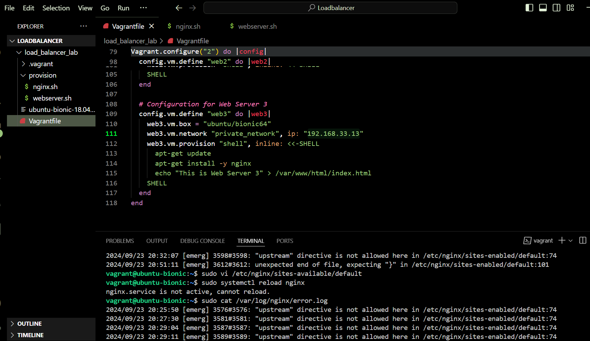
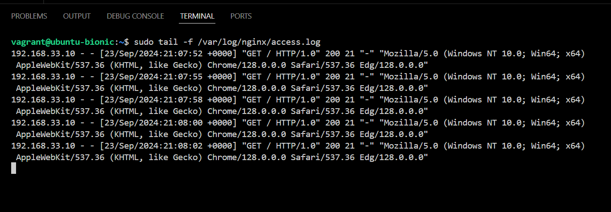
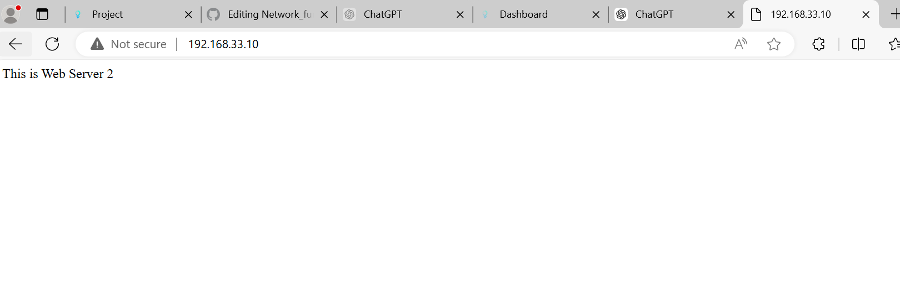
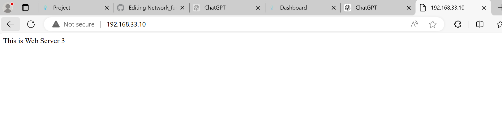
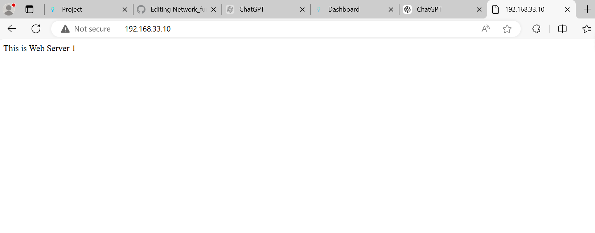

#  Creating a Load Balancer Lab with Nginx and Multiple Vagrant Servers
 This project went on smoothly but i encountered the following errors;
1. The network configuration for the webservers was so wrong i changed it  
2. I didnt know how to place the loadbalancer configurations  in the nginx load balancer but i figured it out .
#### **Below are the documented images for the project**

 **This shows my setup or filr structure for the project**
 

**This confirms that the loadbalancer is  to connected to the webserver**

**This shows the nginx loadbancer is distributing traffic within the three webservers in a round ribbin pattern**

